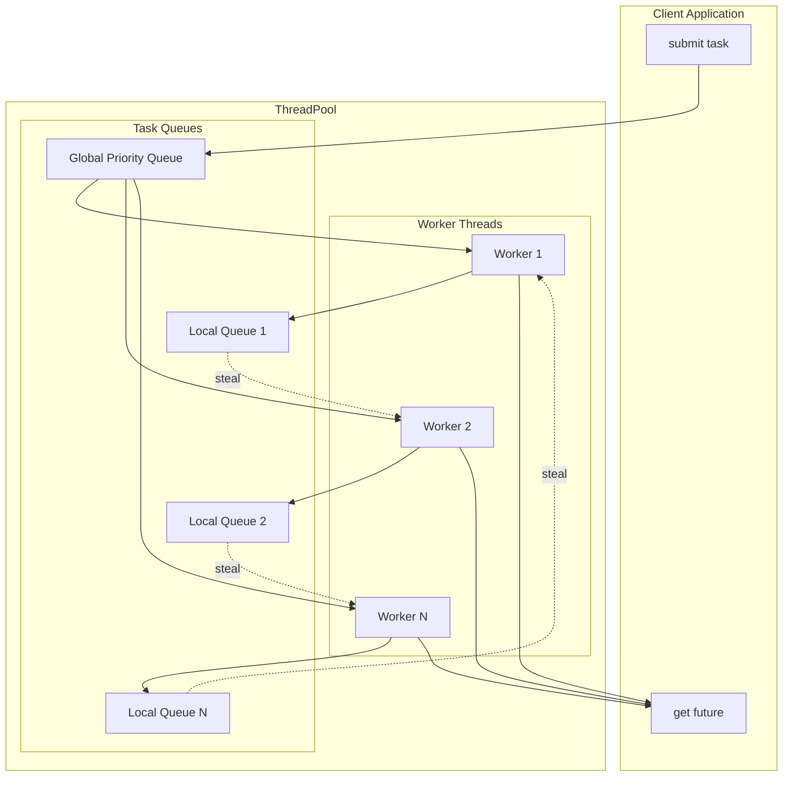
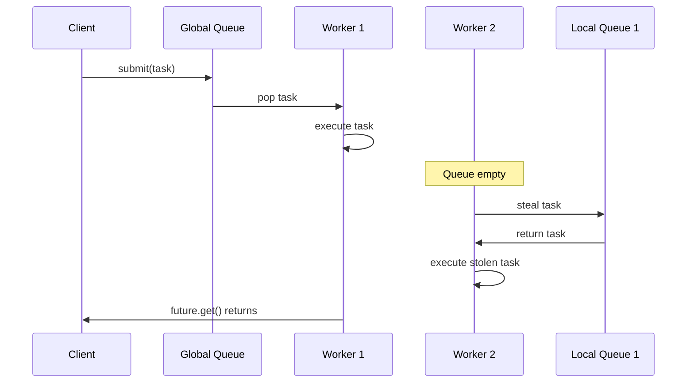
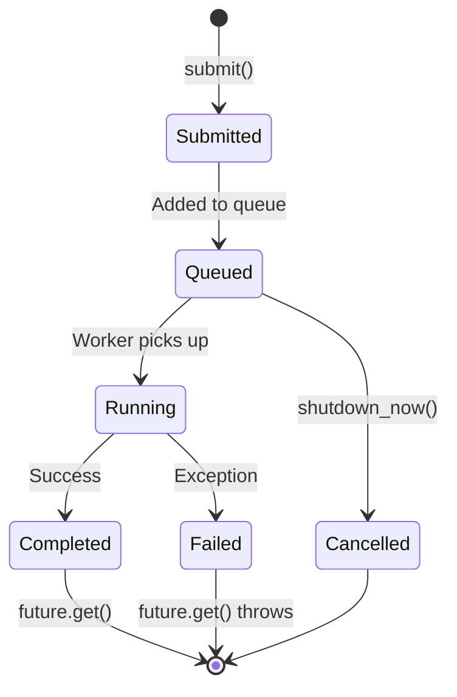

# cpp-threadpool

[](https://en.cppreference.com/w/cpp/17)
[](https://cmake.org/)
[](LICENSE)
[]()
[](https://github.com/rishabh23rohil/cpp-threadpool/actions)

A high-performance, header-only C++17 thread pool library featuring **work-stealing scheduling**, **typed futures**, and **lock-free task queues**. Designed for modern concurrent applications.

---

## Key Features

| Feature | Description |
|---------|-------------|
| **Work Stealing** | Automatic load balancing via per-thread queues with stealing |
| **Typed Futures** | Get return values from async tasks via `std::future<T>` |
| **Priority Scheduling** | Submit urgent vs background tasks with priority levels |
| **Zero Dependencies** | Header-only, uses only C++ standard library |
| **Cross-Platform** | Tested on Linux, macOS, and Windows |

---

## Performance

Benchmarked on 8-core system:

| Workload | Throughput |
|----------|------------|
| Empty tasks | **2.0M+ tasks/sec** |
| Light compute | **800K+ tasks/sec** |
| Heavy compute | **50K+ tasks/sec** |

*Achieves near-linear speedup up to hardware thread count.*

---

## Skills Demonstrated

This project showcases proficiency in:

- **Modern C++ (17/20)** — Templates, `constexpr`, SFINAE, fold expressions
- **Concurrency** — Threads, mutexes, condition variables, atomics
- **Lock-free Programming** — Memory ordering, atomic operations
- **RAII Patterns** — Automatic resource management
- **Generic Programming** — Variadic templates, perfect forwarding
- **Testing** — Unit tests with Google Test, stress testing
- **Build Systems** — CMake, CI/CD with GitHub Actions

---

## Quick Start

```cpp
#include <threadpool/threadpool.hpp>
#include <iostream>

int main() {
    // Create pool with hardware concurrency
    tp::ThreadPool pool;
    
    // Submit task and get future
    auto future = pool.submit([](int x, int y) {
        return x + y;
    }, 40, 2);
    
    std::cout << "Result: " << future.get() << std::endl;  // 42
    
    // Parallel computation
    std::vector<std::future<int>> futures;
    for (int i = 0; i < 1000; ++i) {
        futures.push_back(pool.submit([i] { return i * i; }));
    }
    
    // Collect results
    for (auto& f : futures) {
        std::cout << f.get() << " ";
    }
    
    return 0;
}
```

---

## Installation

### Option 1: Header-Only (Recommended)

```bash
# Copy to your project
cp -r include/threadpool /your/project/include/
```

### Option 2: CMake FetchContent

```cmake
include(FetchContent)
FetchContent_Declare(
    cpp-threadpool
    GIT_REPOSITORY https://github.com/rishabh23rohil/cpp-threadpool.git
    GIT_TAG main
)
FetchContent_MakeAvailable(cpp-threadpool)
target_link_libraries(your_target PRIVATE threadpool)
```

---

## Architecture



### Work-Stealing Flow



---

### Task Lifecycle



---

## API Reference

### Core API

```cpp
namespace tp {

class ThreadPool {
public:
    // Create pool with N threads (default: hardware concurrency)
    explicit ThreadPool(size_t num_threads = std::thread::hardware_concurrency());
    
    // Submit task, get future for result
    template<typename F, typename... Args>
    auto submit(F&& func, Args&&... args) -> std::future<ReturnType>;
    
    // Submit with priority (0 = highest)
    template<typename F, typename... Args>
    auto submit_priority(int priority, F&& func, Args&&... args) -> std::future<ReturnType>;
    
    // Management
    size_t size() const;      // Number of workers
    size_t pending() const;   // Queued tasks
    size_t active() const;    // Running tasks
    void wait();              // Block until all complete
    void shutdown();          // Stop gracefully
    void shutdown_now();      // Cancel pending tasks
};

// Utilities
void parallel_for(ThreadPool& pool, size_t start, size_t end, Func&& func);
auto parallel_map(ThreadPool& pool, Container& input, Func&& func) -> vector<Result>;

} // namespace tp
```

---

## Examples

### Parallel Merge Sort

```cpp
template<typename T>
void parallel_merge_sort(tp::ThreadPool& pool, std::vector<T>& arr, 
                         size_t left, size_t right) {
    if (right - left < 10000) {
        std::sort(arr.begin() + left, arr.begin() + right + 1);
        return;
    }
    
    size_t mid = left + (right - left) / 2;
    
    auto left_future = pool.submit([&] {
        parallel_merge_sort(pool, arr, left, mid);
    });
    
    auto right_future = pool.submit([&] {
        parallel_merge_sort(pool, arr, mid + 1, right);
    });
    
    left_future.wait();
    right_future.wait();
    
    std::inplace_merge(arr.begin() + left, arr.begin() + mid + 1, 
                       arr.begin() + right + 1);
}
```

### Producer-Consumer Pattern

```cpp
tp::ThreadPool pool(8);
std::queue<Task> work_queue;
std::mutex queue_mutex;

// Producer
pool.submit([&] {
    for (int i = 0; i < 1000; ++i) {
        std::lock_guard lock(queue_mutex);
        work_queue.push(generate_task(i));
    }
});

// Consumers
for (int i = 0; i < 4; ++i) {
    pool.submit([&] {
        while (true) {
            Task task;
            {
                std::lock_guard lock(queue_mutex);
                if (work_queue.empty()) break;
                task = work_queue.front();
                work_queue.pop();
            }
            process(task);
        }
    });
}
```

---

## Building & Testing

```bash
# Configure
cmake -B build -DCMAKE_BUILD_TYPE=Release

# Build
cmake --build build

# Run tests
cd build && ctest --output-on-failure

# Run benchmarks
./build/benchmarks/benchmark

# Run examples
./build/examples/basic_usage
./build/examples/parallel_sort
./build/examples/web_crawler
```

---

## Project Structure

```
cpp-threadpool/
├── include/threadpool/
│   └── threadpool.hpp      # Single header implementation
├── examples/
│   ├── basic_usage.cpp     # Getting started guide
│   ├── parallel_sort.cpp   # Parallel merge sort demo
│   └── web_crawler.cpp     # Simulated crawler demo
├── tests/
│   ├── test_basic.cpp      # Core functionality tests
│   ├── test_futures.cpp    # Future/Promise tests
│   └── test_stress.cpp     # High-load stress tests
├── benchmarks/
│   └── benchmark.cpp       # Performance benchmarks
├── .github/workflows/
│   └── ci.yml              # CI/CD pipeline
├── CMakeLists.txt
├── README.md
└── LICENSE
```

---

## Requirements

- **C++17** compatible compiler
  - GCC 7+
  - Clang 5+
  - MSVC 2017+
- CMake 3.16+ (for building tests/examples)

---

## License

MIT License — see [LICENSE](LICENSE) for details.

---

## Author

**Rishabh Rohil**

[](https://github.com/rishabh23rohil)
[](https://linkedin.com/in/YOUR_LINKEDIN)
